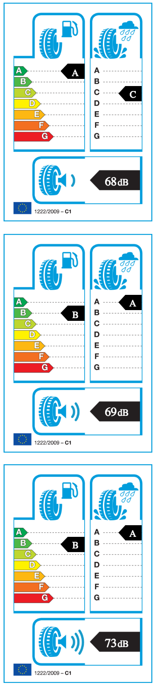

#EU Tyre Label Generator

Using this module you can generate lables required by the EU when selling tyres.
More info: [Click here](http://www.etrma.org/tyres/tyre-labelling)

Usage:

1. Install:
    ```bower install eu-tyre-label-gen ``` or ```npm install eu-tyre-label-gen ```
2. Import script and style
3. Create elements with class 'eu-tyre-label' and necessary attributes (data-fuel, data-rain, data-noise)

```html
<!DOCTYPE html>
<html>
    <head>
        <link rel="stylesheet" href="bower_components/eu-tyre-label-gen/euTyreLabel.css">
        <script src="bower_components/eu-tyre-label-gen/euTyreLabel.js"></script>
    </head>
    <body>
        <div class="eu-tyre-label" data-fuel="A" data-rain="C" data-noise="50"></div>
        <br>
        <div class="eu-tyre-label" data-fuel="B" data-rain="A" data-noise="40"></div>
    </body>
</html>
```

Result:




For different sizes something like 

```html
<html>
    <head>
        <link rel="stylesheet" href="bower_components/eu-tyre-label-gen/euTyreLabel.css">
        <script src="bower_components/eu-tyre-label-gen/euTyreLabel.js"></script>
        <style>
            div#my-container {
                position: relative;
                width: 125px;
                height: 184px;
            }

            div#my-container div.eu-tyre-label {
                position: absolute;
                transform: scale(0.5);
                top: 0px;
                left: 0px;
                height: 0px;
                width: 0px;
            }
        </style>
    </head>
    <body>
        <div id="my-container">
            <div class="eu-tyre-label" data-fuel="A" data-rain="C" data-noise="68"></div>
        </div>
    </body>
</html>
```

can be used or css must be modified manually. 
